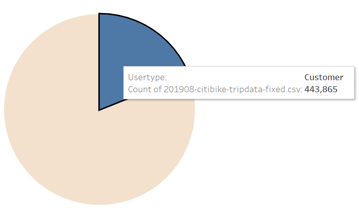
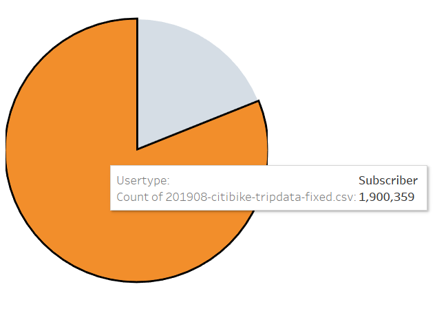
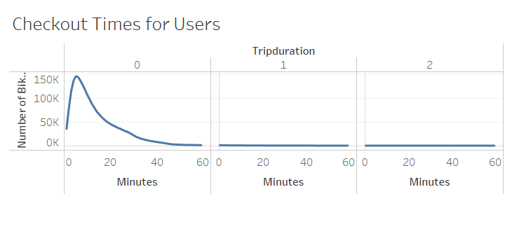
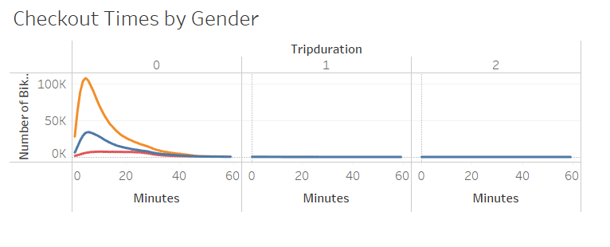
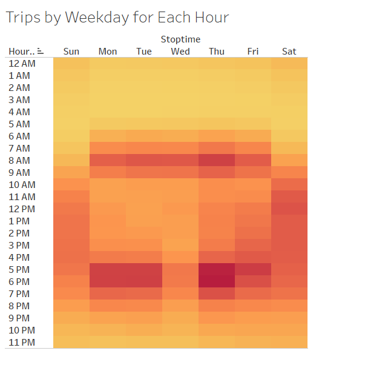
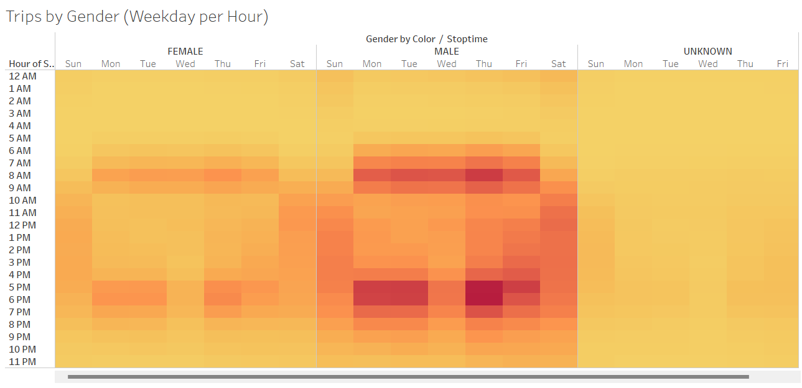
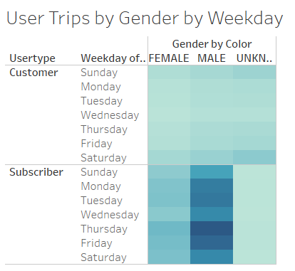
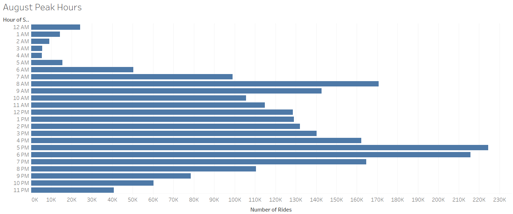

# bikesharing

Link to Tableau dashboard is [here.](https://public.tableau.com/shared/SZFDJ6PKX?:display_count=n&:origin=viz_share_link)

## Overview
Client Kate requested that we analyze CitiBike data from August of 2019 to determine whether or not the bike-sharing platform would be as successful in Des Moines, Iowa as it is in New York City, New York. Through Tableau, a thorough analysis was performed and 7 visualizations were created to illustrate checkout times by user type, checkout times by gender, utilization by user type, utilization by gender per weekday, utilization by weekday per hour, most popular usage per hour for the entirety of August, and utilization of program by user type.

## Results

This visualization compares the usertype to the total number of rides, showing that single-ride users, termed "Customers" make up 443,865 of rides.

This visualization compares the usertype to the total number of rides, showing that reoccurring annual subscribers, termed "Subscribers" make up 1,900,359 of rides.

In this visualzation, we compared trip duration to number of bike rides, showing that a majority of rides are under 20 minutes in duration, with the most being about 10 minutes in duration.

Similar to the visualization above, we compared trip duration to number of bike rides with the added filter of showing a seperation of gender. Female riders tend to have slightly shorter ride durations than Male riders.

This visualization analyzes the peak hours for CitiBike usage, showing that 6am - 9am and 5pm - 7pm on Monday through Friday are the most popular times. This totally makes sense as this would be the times most people are commuting to and from work.

Similarly, this visualization analyzes peak hours per weekday but also seperates by gender. It still shows that peak hours are M-F, 6am - 9am and 5pm - 7pm, but also shows that users are heavily more male than female.

This visualization analyzes trips per user type, by weekday, seperated also by gender. This visualization heavily points to the fact that Male Subscribers are the most common demographic, typically using this service to commute to work Monday - Friday. However, it also shows that Customer user types utilize the service more on the weekends, which would make sense as this would typically be when tourists are seeing the sights.

Finally, we take a look at usage per hour for the month of August, in order to see which hours would be most suitable for bike maintenance. In this visualization, it is obvious that the hours of 2am - 5am would be ideal for maintenance as there are far, far less riders.

## Summary

Given all of the data above, a few generalizations can be made:
- Most users of CitiBike are Subscribers
- Most CitiBike users are Male
- Most CitiBike users are utilizing the service to commute to and from work.
- Customer user types are utilizing CitiBike on the weekends.

Although Des Moines and New York are very different cities, if the proper precautions are taken, CitiBike could also have a successful Des Moines iteration. Some of the precautions I would suggest are analyzing Des Moines commercial and residential areas, as those would be the best places to position bike stations. It would also be important to analyze the existing public transit in Des Moines as well as check to see if Des Moine is traversible by bike (IE: has plentiful bike lanes). LKastly, it would be helpful to perhaps analyze further data outside the month of August to see if CitiBike usage falls during certain seasons, as Des Moines may have more severe winters than New York.

AIn addition to taking the above precautions, it would be my recommendation that the Des Moines chapter of CitiBike market heavily towards Male participants as they tend to be the most popular users, and that they market CitiBike as a great way to commute to their jobs.  It would also be helpful to perhaps offer some incentives to become a Subscriber as that guarantees consistant yearly income.

It is my opinion that further visualizations would be helpful for illustrating this data. Below are my recommendations.

### Additional Visualization 1
I believe it would be helpful to visualize Start Station Latitude and Longitude vs End Station Latitude and Longitude in a map sense to see which areas are most traversed, in order to determine where stations should be set up in Des Moines.
### Additional Visualization 2
It would also be helpful to visualize Birth Year vs. Gender in order to see what specific age demographics to market to for each gender.
